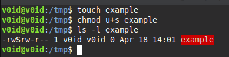

# Privlege Escalation

Once you successfully found a vulnerability and gain access to any user, sure it's not goint to be root, then you have to escalate to gain admin access.

### SUID (Linux)

For privilege escalation in **Linux** I use [GTFObins](https://gtfobins.org/), this web is about binaries that can be used to take advantage for the way the are used.

You have to search first which binaries have the SUID* enabled.

SUID is a bit that allow you to execute a file, program to its owner, binaries used to have **root** owner.



You can see the *S* in the user rights.

To search SUID binaries on /:
```bash
sudo find / -perm /4000 2>&1
```
Once it outputs a vulnerable binary, search it on the web above.

---

### Crontab (Linux)

You can take advantatge on the crontab, actually **cronjobs** by looking for the cronjobs that are currently in the system.

To do this execute:
```bash
crontab -e
```
Then ":" and "q!" + "enter". # It's because it's vi usually.

For example, you see a cronjob that execute a task to clean the history:

```bash
#crontab
*/15 * * * * /tmp/delete.py
```

Every user have acess to /tmp, then you could edit /tmp/delete.py and as I said above, set another functionality to delete.py.

Root Crontabe will execute this file and gaining root access or shell.

---

### Automathic tool:

Tool:
- LinPEAS
- WinPEAS

You can execute those tool to verify weak configuration, misconfiguration and vulnerable SUID's